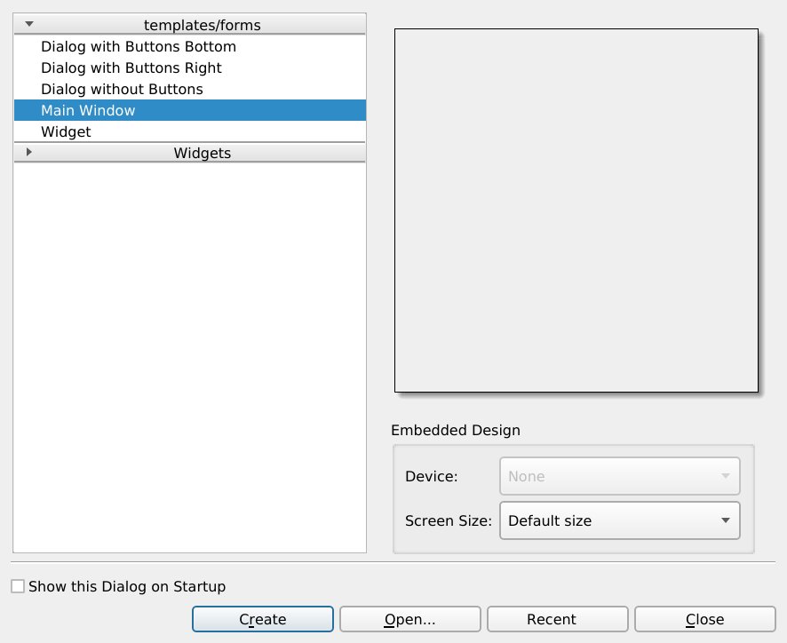

# Cpp, Qt, Designer (.ui) and cmake

Minimal UI application with Qt, Designer (.ui) and cmake

- Create a main window `.ui` file with designer.
  - Start the Qt Designer
  - With "File > New" dialog create a new "Main Window".
- Creatae the source code files:
  - `main.cpp`
  - `sampleapp.h` and `sampleapp.cpp`
  - `mainwindow.h` and `mainwindow.cpp`

- Add menu entries.
- Add a toolbar with icons
  - Add resources
- high definition screen...
- how to attach standard actions to actions defined in the designer's actions editor?
 
## Tutorial

### Requirements

On Ubuntu / Debian Linux you need

- `build-essential`
- `cmake` (>= 3.2),
- `qtbase5-dev`
- `qttools5-dev`
- `qttools5-dev-tools`

### Setup the project

Create a `src` directory.

Create an _empty_ `main.cpp` in the `src` directory:

```cpp
int main()
{
}
```

Create a simple `CMakeLists.txt` file in the project's main directory:

```CMake
cmake_minimum_required(VERSION 3.2)

project(sample-app)

set(CMAKE_CXX_STANDARD 14)

add_executable(sample-app
    src/main.cpp
)
```

Create a `build` directory in your projejct directory.

Open a terminal, `cd` into the build directory, and run:

```sh
$ cmake ..
$ make
```

This will create the `sample-app` executable. You can run it with `./sample-app` and if everything is correct, it will silently run without any output.

### Create a Qt Application

Edit `main.cpp` so that it creates a `QApplication`:

```cpp
#include <QApplication>

int main(int argc, char *argv[])
{
    QApplication app(argc, argv);
    return app.exec();
}
```

Add to `CMakeLists.txt` the commands for working with the Qt framework. At the end it should look like this:

```CMake
cmake_minimum_required(VERSION 3.2)

project(sample-app)

set(CMAKE_CXX_STANDARD 14)

set(CMAKE_INCLUDE_CURRENT_DIR ON)

set(CMAKE_AUTOMOC ON)
set(CMAKE_AUTOUIC ON)

find_package(Qt5Widgets)

add_executable(sample-app
    src/main.cpp
)

target_link_libraries(sample-app
    Qt5::Widgets
)
```

`make` it. Now, when you run your `./sample-app`, the program will not automatically quit, but will wait for being quit. You can quit it by pressing `ctrl-c`.

### Create a window

Open Qt Designer and create a new Main Window.



Create an `ui` directory in your project and save the file as `ui/mainwindow.ui`.

In the `src` directory, add the `mainwindow.h` and `mainwindow.cpp` files.

Those file will _load_ the `mainwindow.ui` file behind the scene.

`mainwindow.h`

```cpp
#ifndef MAINWINDOW_H
#define MAINWINDOW_H

#include <QMainWindow>

namespace Ui {
	class MainWindow;
}

class MainWindow : public QMainWindow
{
    Q_OBJECT
public:
	explicit MainWindow(QWidget *parent = 0);
    ~MainWindow() override;
private:
	Ui::MainWindow *ui;
};
#endif
```

`mainwindow.cpp`

```cpp
#include "mainwindow.h"
#include "../ui/ui_mainwindow.h"

#include <QtWidgets>

MainWindow::MainWindow(QWidget *parent) :
    QMainWindow(parent),
    ui(new Ui::MainWindow)
{
	ui->setupUi(this);
}

MainWindow::~MainWindow()
{
    delete ui;
}
```

In `main.cpp`, _create_ the main window:

```cpp
#include <QApplication>
#include "src/mainwindow.h"

int main(int argc, char *argv[])
{
    QApplication app(argc, argv);

    MainWindow main_window;
    main_window.show();

    return app.exec();
}
```

Finally, add the Main Window files to the  _executable_ section of the `CMakeLists.txt` file:

```CMake
add_executable(sample-app
    src/main.cpp
    src/mainwindow.cpp
)
```

FAQ:

- why `namespace Ui {}`: forward declration of the MainWindow class in the Ui namespace.
- `class MainWindow : public QMainWindow`: MainWindow inherits all behaviors of the QMainWindow class.
- `Q_OBJECT`: a macro that sets up the class for being using inside of the Qt framework.
- There is some magic going on: QApplication will discover by itself that you have created a `QMainWindow`.

### Create _your_ Application

Generally, speaking it's not a good practice to put too much logic in the `main.cpp` or in the `MainWindow`.

For now, we don't have any logic, but we can already create an empty application in the `src/sampleapp.h` and `src/sampleapp.cpp` files:

`sampleapp.h`

```cpp
#ifndef SAMPLEAPP_H
#define SAMPLEAPP_H

#include<QApplication>

class SampleApp : public QApplication
{
    Q_OBJECT
    public:
        explicit SampleApp(int &argc, char *argv[]);
};
#endif
```

```cpp
SampleApp::SampleApp(int &argc, char *argv[]) :
    QApplication(argc, argv)
{
    setApplicationName("Sample App");
    setApplicationVersion("0.1");
}
```

Edit `main.cpp` to use `SampleApp` instead of `QApplication`:

- include `#include "src/sampleapp.h"` instead of `#include <QApplication>`
- create `app` as a `SampleApp`, instead of a `QApplication`:  
  `SampleApp app(argc, argv);`

Finally, add the SampleApp files to the _executable_ section of the `CMakeLists.txt` file:

```CMake
add_executable(sample-app
    src/main.cpp
    src/sampleapp.cpp
    src/mainwindow.cpp
)
```

## Notes

- If Qt is installed in a non standard location or the location is not i nthe path run:  
  `cmake -DCMAKE_PREFIX_PATH="/path/to/the/directory/with/the/cmake/files"`

Get inspired from:

- https://doc-snapshots.qt.io/qt5-5.9/gettingstartedqt.html
- http://doc.qt.io/qt-5/qtsensors-sensorgestures-example.html
- http://doc.qt.io/qt-5/designer-creating-mainwindows.html#toolbars
- http://zetcode.com/gui/qt5/menusandtoolbars/
- not so good qt official documentation: http://doc.qt.io/qt-5/cmake-manual.html
- a better cmake official documentation: https://cmake.org/cmake/help/v3.0/manual/cmake-qt.7.html#manual:cmake-qt(7)
